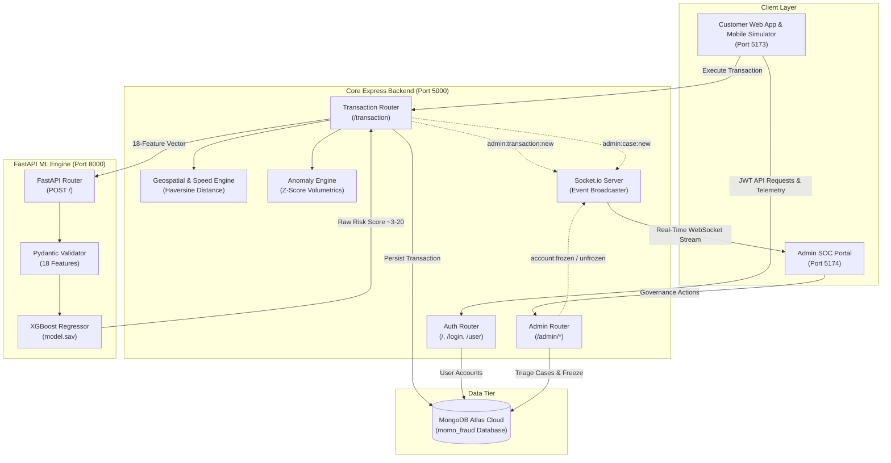
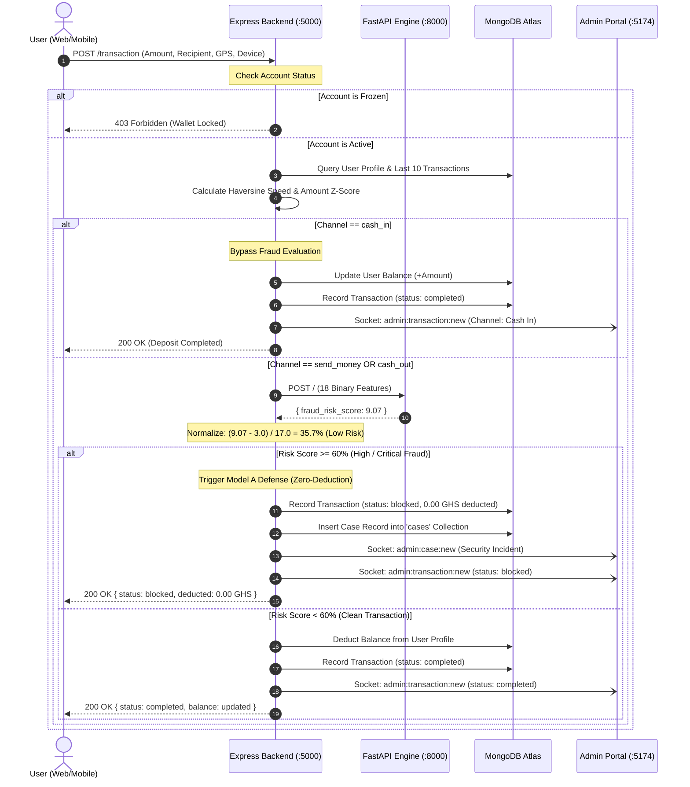
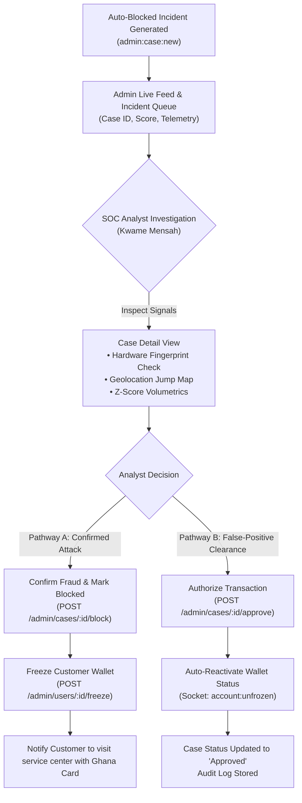

# Simulated Mobile Money (MoMo) Fraud Detection & Prevention Ecosystem

An enterprise-grade, multi-tier Mobile Money simulation and real-time fraud defense platform engineered for West African mobile money networks (specifically modeled on Ghana MTN MoMo and the Swipe Pay architecture). The system integrates a customer-facing responsive web application with an automated Machine Learning (ML) defense engine and a Security Operations Center (SOC) administrative portal.

---

## Table of Contents
1. [Project Overview & Scope](#project-overview--scope)
2. [Key Capabilities & Innovations](#key-capabilities--innovations)
3. [Technology Stack](#technology-stack)
4. [System Architecture & Data Flow](#system-architecture--data-flow)
5. [How the Machine Learning Engine Works](#how-the-machine-learning-engine-works)
   - [Model Specifications](#model-specifications)
   - [18-Feature Behavioral Vector](#18-feature-behavioral-vector)
   - [Normalization & Calibration Range](#normalization--calibration-range)
   - [Defense Policy: Model A (Zero-Deduction Auto-Block)](#defense-policy-model-a-zero-deduction-auto-block)
6. [Operational Channels & Scope](#operational-channels--scope)
7. [Comprehensive Workflow Flowcharts](#comprehensive-workflow-flowcharts)
   - [1. End-to-End Transaction & Defense Pipeline](#1-end-to-end-transaction--defense-pipeline)
   - [2. Human-in-the-Loop SOC Incident Resolution](#2-human-in-the-loop-soc-incident-resolution)
8. [API Reference & Endpoint Map](#api-reference--endpoint-map)
9. [Installation & Setup Guide](#installation--setup-guide)
10. [Default Ports & Service Directory](#default-ports--service-directory)

---

## Project Overview & Scope

Mobile Money is the primary financial rail in West Africa, processing billions of dollars in peer-to-peer transfers, merchant payments, and cash withdrawals. However, it is vulnerable to **Account Takeover via SIM Swap (ATOD)**, **credential harvesting**, **unusual geospatial velocity jumps**, and **social engineering anomalies**.

This project provides a full-stack, production-modeled defense platform consisting of:
1. **Customer Web Application (`frontend/web`)**: A responsive web wallet with biometric liveness scanning, KYC registration with Ghana Card verification, Send Money, Cash Out, Cash In, and an embedded interactive Mobile App Simulator.
2. **Core Backend API (`backend`)**: Express.js server providing JWT authentication, MongoDB Atlas replication, Haversine geospatial speed algorithms, Z-score transaction volume anomaly analysis, and real-time Socket.io dispatching.
3. **Machine Learning Inference Engine (`machine-learning-engine`)**: A FastAPI microservice serving an optimized gradient-boosted regressor (`model.sav`) executing inference in under 15ms.
4. **Admin SOC Governance Portal (`frontend/admin`)**: Real-time analyst portal streaming live transactions, incident triage queues, customer KYC profile inspection, false-positive authorization, and wallet freezing controls.

---

## Key Capabilities & Innovations

- **Live MongoDB Atlas Integration**: All account creation, wallet balances, transaction logs, and incident records are persisted in a live cloud MongoDB Atlas replica set.
- **Model A Defense (Zero-Deduction Auto-Block)**: Transactions evaluated at $\ge 60\%$ fraud risk are immediately blocked in-flight. **0.00 GHS is deducted** from the user's balance, eliminating the need for complex chargeback or recovery workflows.
- **Dual-Pathway Human-in-the-Loop Resolution**:
  - **Pathway A (Confirmed Fraud)**: The transaction remains blocked, and the analyst can lock/freeze the customer's wallet across all channels.
  - **Pathway B (False-Positive Clearance)**: Authorized analysts can clear flagged transactions with a single click, automatically releasing wallet locks.
- **Dynamic Channel Isolation**:
  - **Send Money & Cash Out**: High-risk withdrawal vectors subjected to continuous AI feature extraction and automated blocking.
  - **Cash In (Deposit)**: Safely credited to customer balances and recorded in administrative telemetry, but explicitly bypassed from fraud blocking.

---

## Technology Stack

### Frontend Applications
| Component | Technologies |
| :--- | :--- |
| **Web Customer Client** | React 19, Vite 6, TailwindCSS, Context API, Redux Toolkit, Lucide Icons |
| **Admin SOC Portal** | React 19, Vite 6, TailwindCSS, Recharts, Socket.io-Client, Lucide Icons |
| **Shared Monorepo Lib** | Axios, Socket.io-Client, Shared State & Constants |

### Backend & Microservices
| Component | Technologies |
| :--- | :--- |
| **Core Express API** | Node.js 20+, Express.js 5, Mongoose 9, Socket.io 4, Joi, Bcrypt, Dotenv |
| **ML Inference Engine** | Python 3.10+, FastAPI, Uvicorn, Scikit-Learn, XGBoost, Pickle, Pydantic |
| **Database** | MongoDB Atlas Cloud Replica Set (SSL, Sharded Cluster) |

---

## System Architecture & Data Flow



---

## How the Machine Learning Engine Works

### Model Specifications
- **Architecture**: Gradient Boosted Decision Tree Regressor (XGBoost / Scikit-Learn Ensemble).
- **Serialization**: Python Pickle format (`model.sav`).
- **Inference Runtime**: FastAPI asynchronous service via Uvicorn.
- **Latency Benchmark**: $\approx 4\text{ms} - 12\text{ms}$ per evaluation.

### 18-Feature Behavioral Vector

Before calling the ML engine, the backend gathers user telemetry and runs algorithmic pre-checks to assemble an 18-element binary feature vector:

| # | Feature Key | Derivation Logic & Heuristic |
| :-: | :--- | :--- |
| **1** | `is_new_user` | Set to `1` if user has $\le 1$ completed lifetime transactions. |
| **2** | `txn_unusual_location` | Set to `1` if Haversine distance $> 30\text{ km}$ and calculated velocity exceeds plausible transport speeds ($> 120\text{ km/h}$). |
| **3** | `txn_unusual_time` | Set to `1` if displacement occurs in $< 10\text{ minutes}$ since the previous transaction. |
| **4** | `txn_unusual_amount` | Set to `1` if statistical Z-score $|z| \ge 3.0$ relative to user's rolling historical baseline. |
| **5** | `device_changed` | Set to `1` if current device ID / User-Agent does not match registration hardware fingerprint. |
| **6** | `ip_mismatch` | Network origin disparity flag. |
| **7** | `has_multiple_anomalies` | Compounded flag when $\ge 2$ heuristic anomalies trigger concurrently. |
| **8** | `sim_device_change` | Hardware/SIM swap heuristic indicator. |
| **9** | `account_takeover_risk` | High-confidence ATOD correlation flag. |
| **10** | `fraud_detected` | Historical incident marker. |
| **11** | `was_reversed` | Previous transaction chargeback/reversal record. |
| **12** | `was_reported` | Community or network fraud flag against the sender phone. |
| **13** | `fraud_account_takeover` | Explicit ATOD classification pattern. |
| **14** | `platform_mtn_momo` | Network rail identifier. |
| **15** | `txn_cash_in` | Set to `1` if transaction channel is Cash In (deposit). |
| **16** | `txn_cash_out` | Set to `1` if transaction channel is Cash Out (withdrawal). |
| **17** | `victim_vulnerability` | Account vulnerability metric based on user demographic factors. |
| **18** | `detection_score` | Pre-ensemble heuristic weight. |

### Normalization & Calibration Range

The raw output of the XGBoost regressor operates on an unconstrained continuous scale between **$\approx 3.0$** (clean baseline) and **$\approx 20.0$** (extreme threat).

The platform applies linear min-max scaling clamped between $0.0$ and $1.0$:

$$\text{normalizedScore} = \min\left(1.0, \max\left(0.0, \frac{\text{rawScore} - 3.0}{20.0 - 3.0}\right)\right) = \min\left(1.0, \max\left(0.0, \frac{\text{rawScore} - 3.0}{17.0}\right)\right)$$

#### Risk Categorization Matrix
```
Raw Score:   3.0               8.1              13.2              16.6              20.0+
Normalized:  0%               30%               60%               80%               100%
             |-----------------|-----------------|-----------------|-----------------|
Risk Tier:   [      LOW       ] [    MEDIUM     ] [     HIGH      ] [   CRITICAL      ]
Policy:      [    APPROVED    ] [    ALLOWED    ] [ AUTO-BLOCKED  ] [  AUTO-BLOCKED   ]
Deduction:   Full Amount        Full Amount       0.00 GHS (Zero)   0.00 GHS (Zero)
Case File:   None               None              Auto-Created      Auto-Created
```

---

## Operational Channels & Scope

The platform delineates between three distinct operational channels:

```
                          ┌────────────────────────┐
                          │ Transaction Request    │
                          └──────────┬─────────────┘
                                     │
                 ┌───────────────────┼───────────────────┐
                 ▼                   ▼                   ▼
        ┌────────────────┐  ┌────────────────┐  ┌────────────────┐
        │   Send Money   │  │    Cash Out    │  │    Cash In     │
        │  (P2P Transfer)│  │ (Agent/ATM Out)│  │ (Agent Deposit)│
        └────────┬───────┘  └────────┬───────┘  └────────┬───────┘
                 │                   │                   │
                 ▼                   ▼                   ▼
          txn_cash_out: 0     txn_cash_out: 1     txn_cash_in: 1
          txn_cash_in:  0     txn_cash_in:  0     txn_cash_out: 0
                 │                   │                   │
                 ▼                   ▼                   │
        ┌────────────────────────────────────┐           │
        │ Full XGBoost AI Evaluation & Guard │           │
        └─────────────────┬──────────────────┘           │
                          │                              │
             ┌────────────┴────────────┐                 │
             ▼                         ▼                 │
     Score < 60%: Clean       Score ≥ 60%: High          │
     • Full Deduction         • Model A Auto-Block       │
     • Settled & Completed    • 0.00 GHS Deduction       │
                              • SOC Incident Created     │
                                                         │
                                                         ▼
                                                ┌───────────────────┐
                                                │ Fraud Bypass      │
                                                │ • Exempt from AI  │
                                                │ • Balance Added   │
                                                │ • 0 Cases Logged  │
                                                └───────────────────┘
```

1. **Send Money (`send_money`)**:
   - Primary peer-to-peer rail. Evaluates device fingerprint mismatches, sudden location shifts, and high volume outflows.
2. **Cash Out (`cash_out`)**:
   - High-risk withdrawal vector often exploited in ATOD attacks. Activates `txn_cash_out = 1` in the ML vector.
3. **Cash In (`cash_in`)**:
   - Safe wallet deposit rail. Activates `txn_cash_in = 1`. In accordance with platform policy, **fraud detection is bypassed on deposits**, ensuring clean crediting of user balances without false-positive blocks.

---

## Comprehensive Workflow Flowcharts

### 1. End-to-End Transaction & Defense Pipeline



---

### 2. Human-in-the-Loop SOC Incident Resolution



---

## API Reference & Endpoint Map

### Authentication & KYC
- `POST /` — Register account with Ghana Card, Full Name, Email, Password, Device, and Location.
- `POST /login` — Authenticate using Email/Ghana Card and Password; returns JWT token.
- `GET /user` — Retrieve current authenticated profile, wallet balance, and status (`active` / `frozen`).

### Financial Transactions
- `POST /transaction` — Unified transaction execution (Send Money, Cash Out, Cash In). Runs ML fraud inference in-flight.
- `GET /transaction/user` — Paginated transaction history for the authenticated user.

### ML Inference Microservice (`http://localhost:8000`)
- `POST /` — Accepts 18-feature JSON vector; returns continuous `fraud_risk_score` in $[3.0, 20.0]$.
- `GET /docs` — OpenAPI/Swagger UI documentation.

### Admin Governance (`http://localhost:5000/admin`)
- `POST /admin/login` — Analyst credentials verification.
- `GET /admin/transactions` — All platform transactions formatted with channel badges and customer KYC.
- `GET /admin/cases` — Incident triage queue of all auto-blocked and flagged transactions.
- `GET /admin/cases/:id` — Full forensics record of a specific case.
- `POST /admin/cases/:id/approve` — Pathway B clearance (authorizes transaction, clears wallet restrictions).
- `POST /admin/cases/:id/block` — Pathway A enforcement (confirms fraudulent status).
- `POST /admin/cases/:id/escalate` — Escalate to Tier 2 Lead.
- `POST /admin/cases/:id/notes` — Append immutable analyst notes to case audit log.
- `POST /admin/users/:userId/freeze` — Freeze a compromised wallet.
- `POST /admin/users/:userId/unfreeze` — Unfreeze customer wallet.
- `GET /admin/analytics` — Platform analytics, fraud rates, and channel volume distribution.

---

## Installation & Setup Guide

### Prerequisites
- **Node.js**: `v20.x` or higher
- **Package Manager**: `pnpm` (`npm install -g pnpm`)
- **Python**: `3.10` or higher with `pip`
- **MongoDB Atlas**: Active connection string (pre-configured in `.env`)

### 1. Repository Setup & Dependencies
```bash
# Clone the repository
git clone <repository_url>
cd "Simulated Mobile Money Platform with Machine Learning Fraud Detection"

# Install Node.js monorepo dependencies
pnpm install
```

### 2. Machine Learning Engine Setup
```bash
# Navigate to ML directory
cd machine-learning-engine

# Create and activate Python virtual environment
python -m venv venv
# Windows:
.\venv\Scripts\activate
# macOS/Linux:
source venv/bin/activate

# Install Python ML dependencies
pip install -r requirements.txt
```

### 3. Environment Variables Configuration
Ensure `backend/.env` contains the required database and ML engine references:
```env
PORT=5000
MONGO_URL=mongodb://<username>:<password>@<cluster_nodes>/momo_fraud?ssl=true&replicaSet=atlas-11b4mq-shard-0&authSource=admin&retryWrites=true&w=majority
SECRET_KEY=simulated_momo_secret_key_2026!
URL=http://localhost:8000/
NODE_ENV=development
```

---

## Default Ports & Service Directory

| Service | Port | Local URL | Description |
| :--- | :---: | :--- | :--- |
| **Web Customer App** | `5173` | [http://localhost:5173](http://localhost:5173) | User wallet portal & built-in Mobile Simulator |
| **Admin SOC Portal** | `5174` | [http://localhost:5174](http://localhost:5174) | Security analyst dashboard & incident triage |
| **Core Express API** | `5000` | [http://localhost:5000](http://localhost:5000) | Backend REST API & Socket.io server |
| **FastAPI ML Engine** | `8000` | [http://localhost:8000/docs](http://localhost:8000/docs) | XGBoost model inference & Swagger docs |

### Running the Services Concurrently

Launch each component in dedicated terminal instances:

```bash
# Terminal 1: Python ML Inference Engine
python -m uvicorn index:app --reload --host 127.0.0.1 --port 8000 --app-dir machine-learning-engine

# Terminal 2: Core Express Backend
node backend/index.js

# Terminal 3: Web Customer Portal
pnpm dev:web

# Terminal 4: Admin SOC Portal
pnpm dev:admin
```
